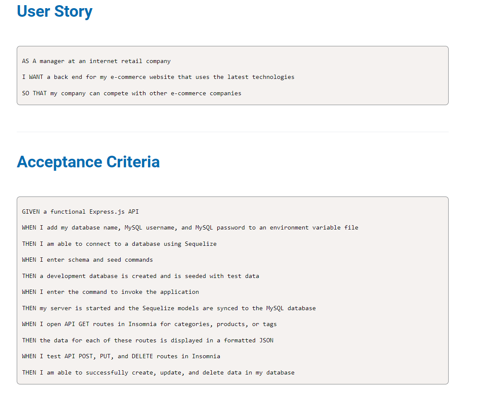

# E-commerce Back End Starter Code

## General Info

## Process
This project was completed using sequelize, dotenv, and express npm packages.

I needed to create models for Category, Product, Tag, and ProductTag.

Then I needed to establish the associations between the different tables

Lastly, I filled out the different routes to ensure the user could interact with the created data models (view all, view by id, create a new post, edit a post, and delete a post).

## Installation

The user needs to first clone the repository from Github.
Next they should make sure to install the npm packages of express, sequelize, dotenv, and mysql2.

They will need to connect to the database by running: mysql -u root -p
- Input password and source the schema.sql file: source db/schema.sql
- Seed the file: npm run seed
- Connect to the server: node server.js or npm start

## Links
Github Repository: https://github.com/hvphan1993/e-commerce-back-end.git

Video Walkthrough: 